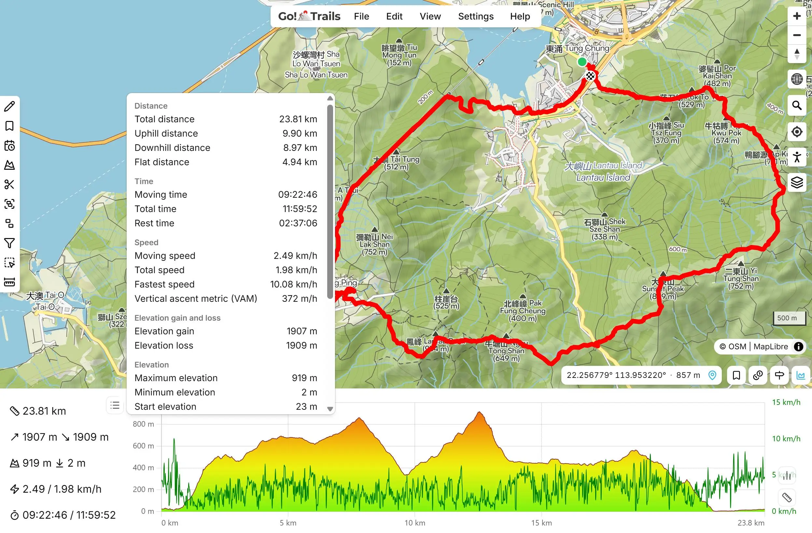

<picture>
  <source media="(prefers-color-scheme: dark)" srcset="website/static/logo-dark.svg">
  
</picture>

[**GoTrails**](https://gotrails.vercel.app) is a free online tool to view, edit, and create GPX and KML tracks: multi-engine routing, accurate elevation profiles, 3D MapLibre maps, POI layers, and rich statistics. It is a feature-extended fork of the legendary [gpx.studio](https://github.com/gpxstudio/gpx.studio).



This repository contains the source code of the website.

## What GoTrails adds

Compared to upstream gpx.studio, this fork adds:

- **Routing** — multiple engines (default OSRM, GraphHopper official/self-hosted, BRouter) with per-activity profiles and private-road handling; fixes for routing-off anchor dragging at high zoom and for anchor-point deletion; a "Show info" action on anchor popups.
- **Elevation** — user-selectable DEM/elevation source (including Mapterhorn terrain); more accurate cumulative gain/loss; unified elevation resampling so drawn and routed tracks match the map terrain; improved flat-distance and VAM metrics.
- **Elevation profile & statistics** — a reworked interactive elevation chart and a "Show all information" full-statistics panel.
- **Map** — MapLibre GL JS v6 with 2D/3D/globe terrain; an expanded basemap/overlay catalog; a live cursor lat/lng and elevation readout; camera/viewport persistence across reloads.
- **Points of interest** — Overpass POI layers with categorized queries and tile caching.
- **Waypoints & tools** — waypoint editing improvements and a clear "waypoint" vs "point of interest" terminology split.
- **File formats** — KML import/export alongside GPX (KML `desc` ↔ GPX `cmt` mapping, single-track naming).
- **UX & quality** — a Clean mode, keyboard shortcuts, and many UI refinements; security hardening (untrusted-value sanitization); type-safety and lint cleanup; and several state-management/immer bug fixes.

## Contributing

Please create an issue if you find a bug or have a feature request.

Code contributions are also welcome, but except for obvious bug fixes, please open an issue first to discuss the changes you would like to make.

## Development

The code is split into two parts:

- `gpx`: a Typescript library for parsing and manipulating GPX files,
- `website`: the website itself, which is a [SvelteKit](https://kit.svelte.dev/) application.

You will need [Node.js](https://nodejs.org/) to build and run these two parts.

### Building the `gpx` library

```bash
cd gpx
npm install
npm run build
```

### Running the website

```bash
cd website
npm install
npm run dev
```

## Credits

GoTrails is based on the open-source [gpx.studio](https://github.com/gpxstudio/gpx.studio) project.

This project has been made possible thanks to the following open source projects:

- Development:
    - [Svelte](https://github.com/sveltejs/svelte) and [SvelteKit](https://github.com/sveltejs/kit) — seamless development experience
    - [MDsveX](https://github.com/pngwn/MDsveX) — allowing a Markdown-based documentation
- Design:
    - [shadcn-svelte](https://github.com/huntabyte/shadcn-svelte) — beautiful components
    - [@lucide/svelte](https://github.com/lucide-icons/lucide/tree/main/packages/svelte) — beautiful icons
    - [tailwindcss](https://github.com/tailwindlabs/tailwindcss) — easy styling
    - [Chart.js](https://github.com/chartjs/Chart.js) — beautiful and fast charts
- Logic:
    - [immer](https://github.com/immerjs/immer) — complex state management
    - [Dexie.js](https://github.com/dexie/Dexie.js) — IndexedDB wrapper
    - [fast-xml-parser](https://github.com/NaturalIntelligence/fast-xml-parser) — fast GPX file parsing
    - [SortableJS](https://github.com/SortableJS/Sortable) — creating a sortable file tree
- Mapping:
    - [MapLibre GL JS](https://github.com/maplibre/maplibre-gl-js) — beautiful and fast interactive map rendering
    - [GraphHopper](https://github.com/graphhopper/graphhopper) — powerful routing engine
    - [OpenStreetMap](https://www.openstreetmap.org) — open map data used by most of the map layers, and by the routing engine
    - [Mapterhorn](https://github.com/mapterhorn/mapterhorn) — high-quality open terrain data used by some map layers (including for 3D), and by the routing engine
- Search:
    - [DocSearch](https://github.com/algolia/docsearch) — search engine for the documentation

## License

This project is licensed under the MIT License - see the [LICENSE](LICENSE) file for details.
